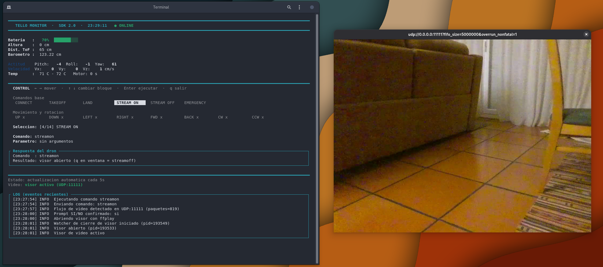

# Tello Edu Monitor

Language: [Español](README.es.md) | [English](README.md)

Control and monitor your DJI Tello or Tello EDU from a terminal interface.



## Quickstart

1. Connect your computer to the drone Wi-Fi network: TELLO-XXXXXX.
2. Install required tools:
   - Bash 4+
   - Python 3
   - One UDP listener tool: socat (recommended), or nc
3. Optional for video window:
   - ffplay (recommended) or mpv
4. Run:

```bash
chmod +x tello_monitor.sh
./tello_monitor.sh
```

1. In the TUI:
   - Select CONNECT first.
   - Then use TAKEOFF, LAND, movement commands, and STREAM ON/OFF.

## What You Get

- Live telemetry panel (battery, height, attitude, speed, temperature, motor time).
- Keyboard command selector for flight and movement commands.
- Stream check on UDP 11111 after STREAM ON.
- Optional video viewer prompt after stream starts.
- Auto stream shutdown when closing the video window with q.
- Event log panel at the bottom of the TUI.
- Responsive layout that adapts to terminal size.

## Requirements

- Linux or macOS
- Bash 4+
- Python 3
- Wi-Fi connection to TELLO-XXXXXX

Optional but recommended:

- socat for UDP listening fallback
- ffplay (from ffmpeg) or mpv for video preview

Install examples:

```bash
# Debian / Ubuntu
sudo apt install socat ffmpeg

# Arch Linux
sudo pacman -S socat ffmpeg

# macOS
brew install socat ffmpeg
```

## Keyboard Controls

- Left/Right: move selection inside current command block
- Up/Down: switch between base and movement blocks
- Enter: run selected command
- c: cancel numeric input prompt for movement commands
- q: quit monitor
- Ctrl+C: quit monitor

## Commands

| Command | Argument | Valid Range |
| --- | --- | --- |
| command | No | - |
| takeoff | No | - |
| land | No | - |
| streamon | No | - |
| streamoff | No | - |
| emergency | No | - |
| up x | Yes | 20-500 cm |
| down x | Yes | 20-500 cm |
| left x | Yes | 20-500 cm |
| right x | Yes | 20-500 cm |
| forward x | Yes | 20-500 cm |
| back x | Yes | 20-500 cm |
| cw x | Yes | 1-360 degrees |
| ccw x | Yes | 1-360 degrees |

## Video Streaming

When you run STREAM ON:

1. The monitor sends streamon.
2. It checks whether UDP packets are arriving on port 11111.
3. It asks whether you want to open a video window.
4. If you confirm, it starts ffplay or mpv.
5. If you press q in the video window, streamoff is sent automatically.

## Network Ports

| Flow | Protocol | Address | Port |
| --- | --- | --- | --- |
| PC -> Tello commands | UDP | 192.168.10.1 | 8889 |
| Tello -> PC command response | UDP | 0.0.0.0 bind | 9000 |
| Tello -> PC state | UDP | 0.0.0.0 bind | 8890 |
| Tello -> PC video | UDP | 0.0.0.0 bind | 11111 |

## Troubleshooting

- No telemetry:
  - Confirm Wi-Fi is TELLO-XXXXXX.
  - Send CONNECT first.
- STREAM ON returns ok but no video:
  - Ensure your network is stable.
  - Check if port 11111 is already in use.
  - Try opening viewer anyway from the prompt.
- No video window opens:
  - Install ffplay (ffmpeg) or mpv.
- Command timeouts:
  - Move closer to the drone.
  - Check battery level.

## Safety Notes

- Always fly in a safe, open area.
- Test takeoff and land before advanced moves.
- Keep emergency command ready.
- The script sends periodic keepalive commands to reduce auto-landing due to inactivity.

## Project Structure

```text
03. Tello_Edu_Monitor/
├── tello_monitor.sh
├── README.md
└── README.es.md
```

## Reference

- [Tello SDK 2.0 User Guide](https://dl-cdn.ryzerobotics.com/downloads/Tello/Tello%20SDK%202.0%20User%20Guide.pdf)
